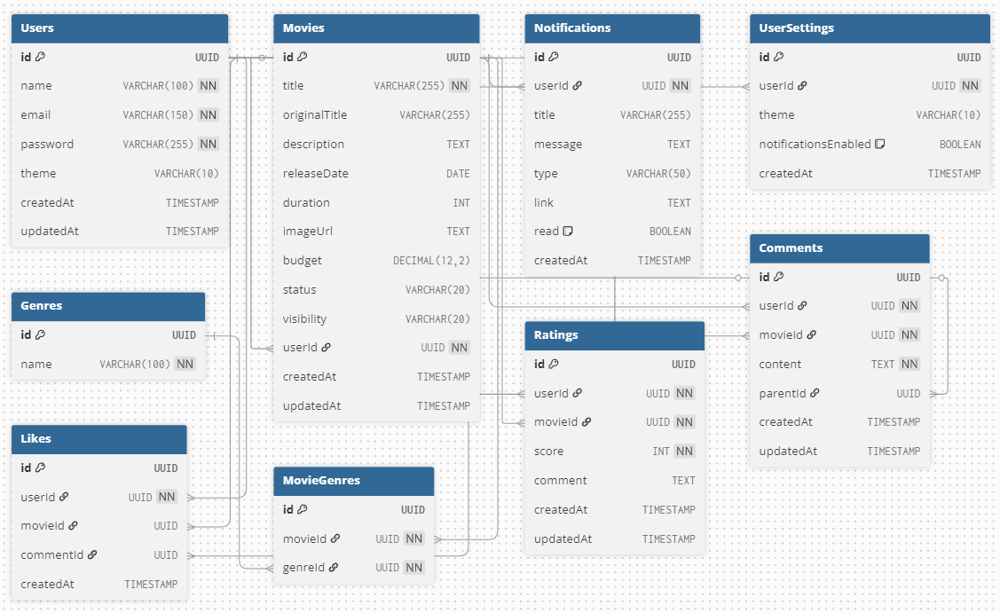

# 🎬 Desafio Tech — Frontend

## 🧭 Índice

- [🎬 Desafio Tech — Frontend](#-desafio-tech--frontend)
- [🧠 Visão Geral](#-visão-geral)
- [🧠 Objetivo do Projeto](#-objetivo-do-projeto)
- [🧱 Estrutura Inicial do Projeto](#-estrutura-inicial-do-projeto)
- [📂 Estrutura de Pastas](#-estrutura-de-pastas)
- [🧭 Filosofia da Arquitetura](#-filosofia-da-arquitetura)
- [⚙️ Tecnologias Utilizadas](#️-tecnologias-utilizadas)
- [🧩 Dependências do Projeto](#-dependências-do-projeto)
- [🎨 Configuração do TailwindCSS](#-configuração-do-tailwindcss)
- [🚀 Scripts Disponíveis](#-scripts-disponíveis)
- [🖥️ Pré-requisitos](#️-pré-requisitos)
- [⚡ Instalação e Execução](#-instalação-e-execução)
- [🧠 Padrões de Código](#-padrões-de-código)
- [📘 Modelagem do Banco de Dados](#-modelagem-do-banco-de-dados)
- [🧾 Licença](#-licença)
- [✨ Autor](#-autor)

## 🧠 Visão Geral

Este repositório contém o **frontend** da aplicação desenvolvida em **React + TypeScript**, com **TailwindCSS** para estilização e **Vite** como bundler principal.  
O objetivo é construir uma interface moderna, performática e bem estruturada, seguindo boas práticas de desenvolvimento front-end e uma arquitetura escalável.

---

## 🎯 Objetivo do Projeto

O **Desafio Tech Frontend** tem como objetivo desenvolver uma aplicação completa para gerenciamento e exibição de filmes.  
O sistema permite **listar, filtrar, cadastrar, editar e visualizar detalhes de filmes**, além de oferecer uma interface responsiva e intuitiva.

Essa aplicação faz parte de um desafio técnico voltado à demonstração de **boas práticas de desenvolvimento, componentização e integração com API**.

## 🧱 Estrutura Inicial do Projeto

O projeto foi iniciado com **React + TypeScript + TailwindCSS**, seguindo uma arquitetura modular e organizada desde o primeiro commit.  
A estrutura foi planejada para garantir **escalabilidade**, **reutilização de componentes** e **padronização visual** desde o início.

### 🧠 **Node.js 20.25.0 + npm**

Ambiente base de execução e gerenciamento de dependências.  
A versão **20.25.0** foi escolhida por sua estabilidade LTS e compatibilidade com o ecossistema moderno do React e Vite.

---

### 📂 Estrutura de Pastas

src/
├── assets/
│
├── components/
│ ├── common/
│ │ ├── Button.tsx
│ │ ├── Drawer.tsx
│ │ ├── FormsFields.tsx
│ │ ├── Input.tsx
│ │ ├── Loading.tsx
│ │ ├── Modal.tsx
│ │ ├── NotFoundState.tsx
│ │ ├── Pagination.tsx
│ │ ├── Select.tsx
│ │ ├── Textarea.tsx
│ │
│ ├── layout/
│ │ ├── AppLayout.tsx
│ │ ├── Footer.tsx
│ │ ├── Header.tsx
│ │
│ ├── movies/
│ ├── InfoCard.tsx
│ ├── MovieActions.tsx
│ ├── MovieCard.tsx
│ ├── MovieDrawer.tsx
│ ├── MovieTeam.tsx
│ ├── MovieTrailer.tsx
│ ├── RatingCircle.tsx
│
├── context/
│ ├── AuthContext.tsx
│ ├── MoviesContext.tsx
│
├── hooks/
│ ├── useMovies.ts
│ ├── useTheme.ts
│
├── lib/
│ ├── api.ts
│ ├── auth.ts
│ ├── movies.ts
│ ├── Notifications.ts
│ ├── passwordReset.ts
│ ├── users.ts
│
├── pages/
│ ├── Home.tsx
│ ├── Login.tsx
│ ├── MovieDetails.tsx
│ ├── NotFound.tsx
│ ├── Signup.tsx
│
├── routes/
│ ├── AppRoutes.tsx
│ ├── ProtectedRoute.tsx
│
├── types/
│ ├── auth.ts
│ ├── movies.ts
│ ├── user.ts
│
├── utils/
│ ├── fields.ts
│ ├── handleChangeInput.ts
│ ├── pathVideo.ts
│ ├── validateRequiredFields.ts
│
├── App.css
├── App.tsx
├── index.css
├── main.tsx
│
├── eslint.config.js
├── postcss.config.js
├── tailwind.config.js
├── tsconfig.app.json
├── tsconfig.node.json
├── tsconfig.json
├── vite.config.ts
├── package.json
├── package-lock.json
└── README.md

---

**📌 Organização:**

- **assets/** → arquivos estáticos e imagens do projeto.
- **components/** → contém todos os componentes reutilizáveis da aplicação.
  - **common/** → componentes genéricos (botões, modais, inputs, loaders, etc.).
  - **layout/** → estrutura base da interface (Header, Footer, Layout principal).
  - **movies/** → componentes específicos do domínio de filmes (cards, drawer, trailer, rating, etc.).
- **context/** → contextos globais de autenticação e gerenciamento de filmes.
- **hooks/** → hooks customizados de lógica compartilhada (`useMovies`, `useTheme`).
- **lib/** → camada de comunicação com a API e serviços auxiliares.
- **pages/** → telas principais da aplicação (Home, Login, Detalhes, etc.).
- **routes/** → gerenciamento das rotas públicas e protegidas.
- **types/** → definições de tipos TypeScript utilizadas em todo o projeto.
- **utils/** → funções utilitárias e auxiliares (validações, formatação, campos dinâmicos).
- **configs (raiz)** → arquivos de configuração do Vite, Tailwind, TypeScript, ESLint e PostCSS.

---

## 🧭 Filosofia da Arquitetura

A arquitetura do projeto foi construída com base em **princípios de componentização, reuso e separação de responsabilidades**, inspirada em conceitos do **Atomic Design** e em práticas modernas de **Clean Architecture** para aplicações front-end.

### 🧩 Princípios Fundamentais

- **Componentização por domínio**  
  Cada módulo (`movies/`, `common/`, `layout/`, etc.) foi organizado por escopo funcional, facilitando a manutenção e a escalabilidade do sistema.  
  Assim, cada parte da interface conhece apenas o que precisa — evitando dependências desnecessárias.

- **Reutilização e consistência visual**  
  Componentes genéricos e reutilizáveis ficam centralizados em `common/`, garantindo **padronização visual**, **menor duplicação de código** e **facilidade de evolução** da UI.

- **Responsabilidade única (Single Responsibility)**  
  Cada componente e arquivo possui uma função clara: seja exibir informações, manipular dados, ou configurar rotas/contextos.  
  Essa divisão permite um fluxo mais previsível e reduz o acoplamento entre as camadas.

- **Clean Architecture aplicada ao front-end**  
  As pastas `lib/`, `context/`, `hooks/`, `types/` e `utils/` seguem uma separação de camadas inspirada na Clean Architecture:

  - **`lib/`** → comunicação com APIs externas e integrações.
  - **`context/`** → controle de estado global e regras de negócio compartilhadas.
  - **`hooks/`** → abstração de lógicas específicas e reutilizáveis.
  - **`types/`** → contratos de dados e tipagens centralizadas.
  - **`utils/`** → funções puras e utilitárias.

- **Previsibilidade e clareza**  
  O código segue um padrão de nomenclatura intuitivo e uniforme.  
  Arquivos e componentes são nomeados de forma descritiva, facilitando a navegação e entendimento rápido por novos desenvolvedores.

---

> 🧠 **Resumo:**  
> O foco desta arquitetura é proporcionar **clareza**, **escalabilidade** e **organização modular**, mantendo uma curva de aprendizado suave e permitindo crescimento sustentável do projeto sem perda de controle estrutural.

## ⚙️ Tecnologias Utilizadas

### 🧩 **React + TypeScript**

Escolhidos pela **robustez, tipagem estática e componentização moderna**.  
O uso de **TypeScript** garante segurança e previsibilidade durante o desenvolvimento, reduzindo erros e facilitando manutenção e refatoração.

### ⚡ **Vite**

Ferramenta de build moderna e ultrarrápida, usada para desenvolvimento e empacotamento da aplicação.  
Vantagens:

- Hot Reload instantâneo
- Suporte nativo a TypeScript e JSX
- Build otimizado e leve

### 🎨 **TailwindCSS**

Framework utilitário para estilização rápida e consistente.  
A escolha foi feita para garantir:

- Padronização visual alinhada ao design system (Figma)
- Produtividade no desenvolvimento com classes utilitárias
- Suporte nativo a **modo escuro** e responsividade fluida

## 🧩 Dependências do Projeto

### 📦 **Dependências principais**

| Pacote                    | Função                                           |
| :------------------------ | :----------------------------------------------- |
| **react** / **react-dom** | Base do framework e renderização dos componentes |
| **axios**                 | Comunicação com a API backend                    |
| **react-router-dom**      | Gerenciamento de rotas SPA                       |
| **tailwindcss**           | Estilização com classes utilitárias              |
| **lucide-react**          | Biblioteca de ícones minimalistas e escaláveis   |
| **framer-motion**         | Animações declarativas e fluidas                 |
| **react-hot-toast**       | Notificações de feedback para o usuário          |
| **clsx**                  | Combinação condicional de classes CSS            |

### 🧰 **Dependências de desenvolvimento**

| Pacote                         | Função                                       |
| :----------------------------- | :------------------------------------------- |
| **vite**                       | Bundler rápido e moderno                     |
| **typescript**                 | Tipagem estática e integração com React      |
| **eslint / typescript-eslint** | Padronização e qualidade de código           |
| **autoprefixer / postcss**     | Compatibilidade automática entre navegadores |
| **@vitejs/plugin-react**       | Suporte aprimorado para React no Vite        |
| **globals**                    | Definições globais para ESLint e TypeScript  |

## 🎨 Configuração do TailwindCSS

O projeto utiliza **TailwindCSS** com configuração personalizada para refletir a paleta do Figma e suportar **modo claro/escuro**.

### 🧰 Arquivo de configuração (`tailwind.config.js`)

## 🚀 Scripts Disponíveis

| Comando           | Descrição                                                          |
| :---------------- | :----------------------------------------------------------------- |
| `npm run dev`     | Inicia o servidor de desenvolvimento com **Vite**                  |
| `npm run build`   | Realiza a build de produção e compila os tipos **TypeScript**      |
| `npm run preview` | Pré-visualiza o build gerado localmente                            |
| `npm run lint`    | Executa o **ESLint** para validação e correção de estilo de código |

---

## 🖥️ Pré-requisitos

Certifique-se de ter instalado:

- **Node.js 20.25.0**
- **npm** (gerenciador de pacotes padrão)

---

## ⚡ Instalação e Execução

```bash
# 1️⃣ Clone o repositório
git clone https://github.com/gabrielliborges-web/Desafio-Tech-Front.git

# 2️⃣ Acesse a pasta do projeto
cd desafio-tech-front

# 3️⃣ Instale as dependências
npm install

# 4️⃣ Inicie o servidor de desenvolvimento
npm run dev

```

O projeto estará disponível em:  
👉 **[http://localhost:5173](http://localhost:5173)**

---

## 🧠 Padrões de Código

- **TypeScript + ESLint** → garante padronização e segurança de tipos.
- **Arquitetura por domínio** → cada módulo (ex: `movies/`, `filters/`) possui seus próprios componentes e responsabilidades.
- **Componentes reutilizáveis** → tudo que pode ser reaproveitado está dentro de `common/`.
- **Estilização declarativa** → **TailwindCSS** aplicado de forma semântica e consistente.

---

## 📘 Modelagem do Banco de Dados

> A modelagem de dados é utilizada para integração com o backend, refletindo as entidades de **Filmes**, **Gêneros** e **Avaliações**.



---

## 🧾 Licença

Este projeto é distribuído sob a licença **MIT**, permitindo uso, modificação e distribuição livre, desde que o crédito seja mantido.

---

## ✨ Autor

**Desenvolvido por [Gabrielli Borges](https://github.com/gabrielliborges)**  
💡 _Desenvolvedora Full Stack_ | React • Node.js • TypeScript • Tailwind • Prisma • PostgreSQL
